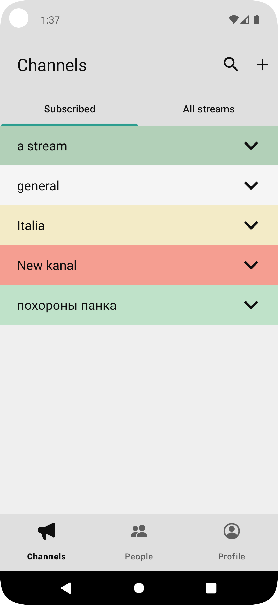
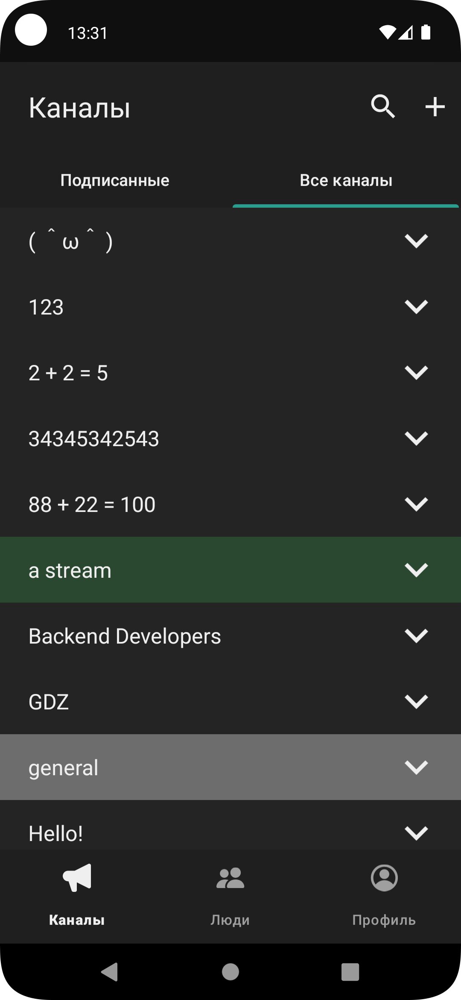
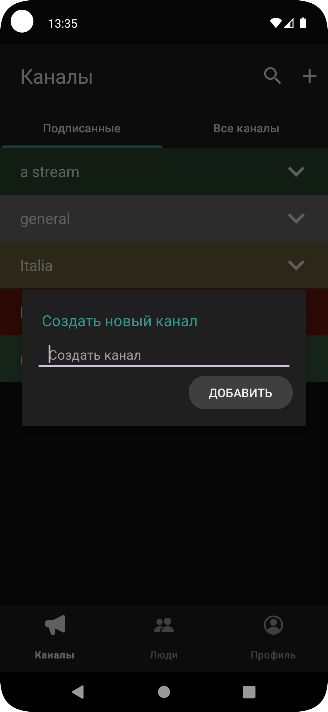
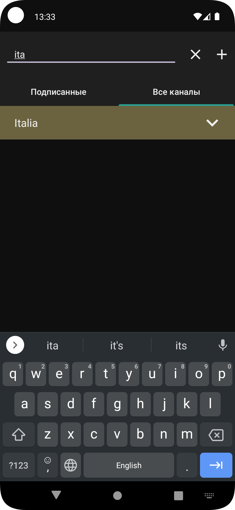
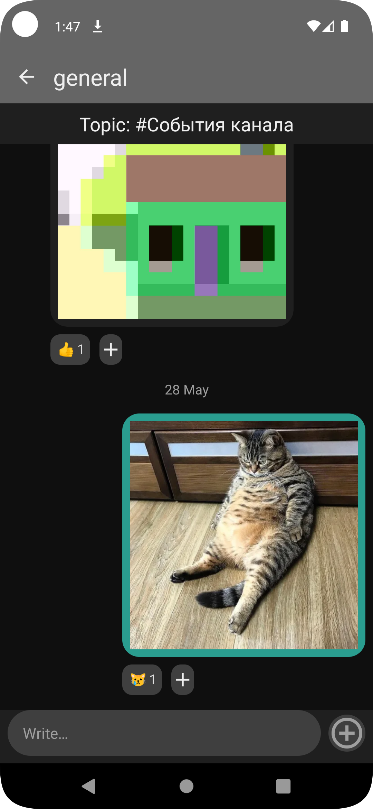
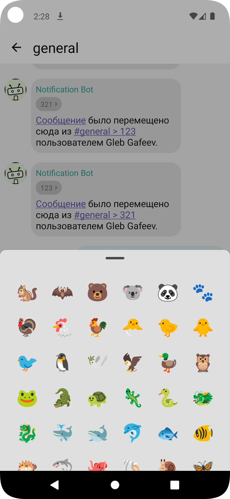
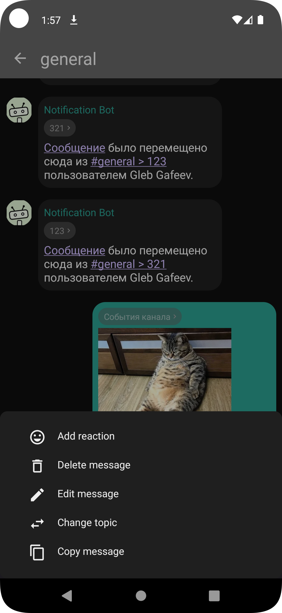
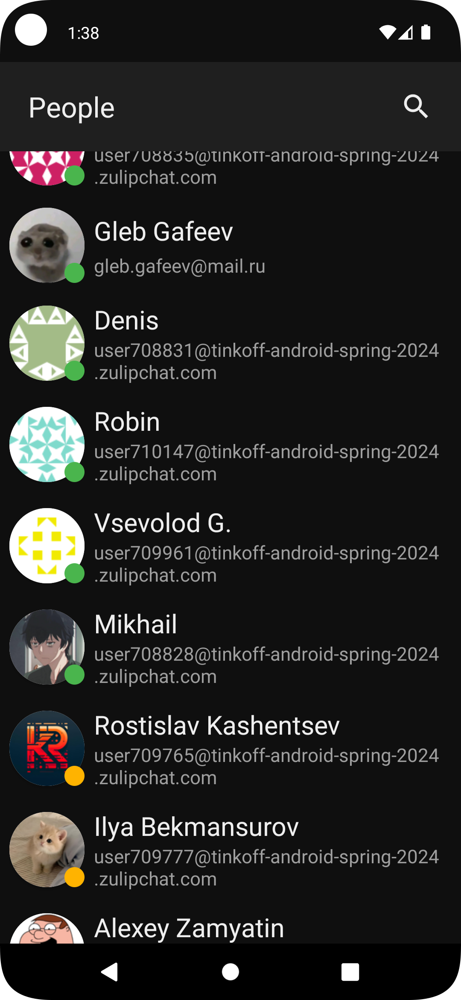
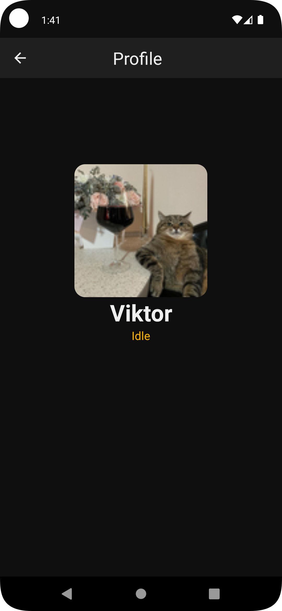
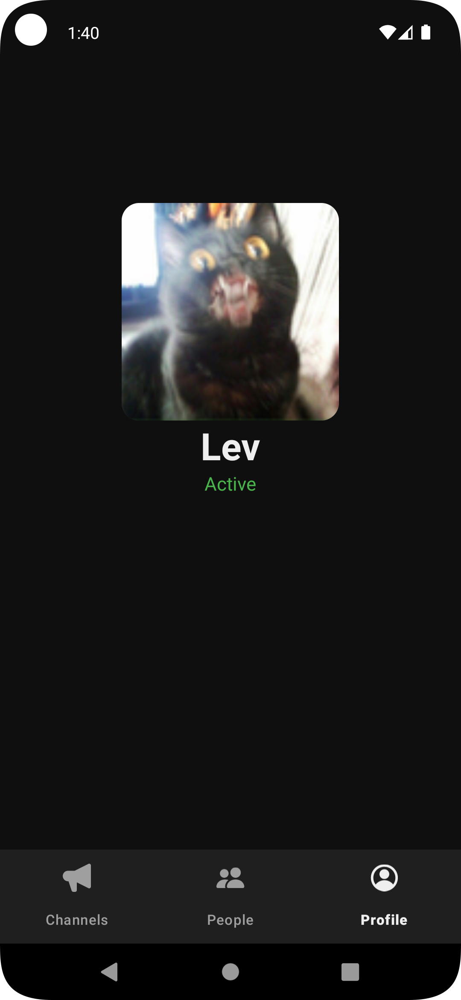

### Messenger
#### Android messaging application.

#### The application features the following functionalities:
* Loading user, channel, and message information via the internet
* Caching information in a database
* Searching among users, topics, and channels
* List of users with detailed view option
* List of channels and topics
* Creating new channels
* Loading messages in batches of 20
* Editing the text of recently sent messages
* Sending messages to existing or new topics
* Changing the topic of recent messages
* Copying message text
* Deleting recently sent messages from the chat
* Sending and deleting emojis
* Sending and viewing images
* Supporting Russian and English languages
* Supporting light and dark themes
#### The application uses the following technologies:
* Layout: [XML](https://www.w3.org/XML/), CustomView, RecyclerView
* Navigation: [Cicerone](https://github.com/terrakok/Cicerone)
* Asynchronous operations: [Coroutines](https://github.com/Kotlin/kotlinx.coroutines)
* Networking: [Retrofit](https://square.github.io/retrofit/) + [OkHttp](https://square.github.io/okhttp/), [Picasso](https://square.github.io/picasso/)
* Database: [Room](https://developer.android.com/jetpack/androidx/releases/room)
* Architecture: [TEA](https://github.com/vivid-money/elmslie)
* Dependency Injection: [Dagger](https://dagger.dev)
* Testing: [Kotest](https://kotest.io/), [Kaspresso](https://github.com/KasperskyLab/Kaspresso), [Wiremock](https://wiremock.org/)

&nbsp;
&nbsp;
&nbsp;
&nbsp;
&nbsp;
 
&nbsp;
&nbsp;
&nbsp;
&nbsp;
&nbsp;
 

